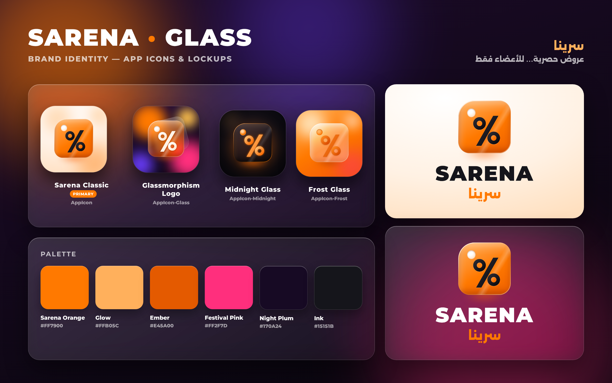

# Sarena · سرينا

Sarena is an iOS app for exclusive discounts and bookings in Oman. It is for members only: nobody sees a venue or a price without an account. It's built with **SwiftUI + MVVM** and has a calm design: white cards on a plain grey background, with Sarena orange as a small accent. It is fully localized in **English and Arabic (RTL)**.



## Open & run

1. Open `Sarena.xcodeproj` in **Xcode 15 or newer**.
2. Select the **Sarena** target → *Signing & Capabilities* → choose your Team.
3. Run on an iPhone simulator or device (iOS 17+).

## Server

* **Always `https://sarena.tech`** (`Services/ServerAddress.swift`). Nothing can change or show it: no setting, no link, no screen. It's HTTPS only, and the sign-in token is kept in the Keychain. Settings from earlier versions (a linked tunnel server, demo accounts) are erased on launch.
* **Accounts:** there are no built-in or demo accounts. Members create one in the app; the owner's account (`saqer@sarena.tech`) also works here, with a membership.
* **Live:** changes made in the control panel reach the open app within about a second (Server-Sent Events): venues and events, prices and tickets, the membership plan and discounts, seasonal looks, memberships and codes. Before sign-in, the welcome and sign-in screens follow the seasonal look the same way. The app also re-checks everything each time it returns to the foreground; ETags keep that cheap (`Stores/LiveSync.swift`).
* **Previews and tests** use on-device stand-ins (`AppServices.preview`), which start with no accounts and send random SMS codes.

## First launch flow

1. **Launch screen**: the Sarena lockup on a warm background, set in `Info.plist › UILaunchScreen`.
2. **Splash**: the Sarena logo while the session restores.
3. **Language picker**: greeting chips ("Hello · مرحبا · Hola…") and language cards. Arabic and English are live; French, Spanish, Russian and Chinese are marked *Soon*.
4. **Onboarding carousel**: three illustrated pages with *Continue* / *Skip* and a capsule page indicator.
5. **Sign in**: by **mobile number (SMS code)** or **email + password**, or **Create a free account**.

## Features

| Area | What's inside |
| --- | --- |
| Auth | Phone OTP (SMS AutoFill), email/password, registration with live validation (Omani numbers, Arabic-Indic digits, password strength), Keychain-backed session |
| Dashboard | Savings banner, 3D "cover-flow" featured carousel with live countdowns, the 7 category cards, a "Biggest savings" list, search |
| Categories | Cinema · Jet Ski · Oman Shooting Club · Oman Automobile Association · Ibri Arena · Video Game Arcades · Oman Festivals (Ibri & Muscat Nights) |
| Venue detail | Hero photo (uploaded from the dashboard) or category art, with the discount disc inside the picture. Also: event dates, description, highlights, and a MapKit `Map` with a marker and directions. **Ticket options** show the struck-through original price vs the member price, with live scarcity. Then quantity and a floating **Book Now** bar; without a membership that bar shows **Become a member** instead |
| My Account (حسابي) | Membership card, **member savings** (total saved, ready and redeemed codes, a link to the Wallet) and the **Sarena membership**. There is one plan: **15 OMR a year**, set in the dashboard. The screen shows its status, valid-until date, days left, progress, perks and a **Subscribe / Renew** button, whose confirmation is anchored to the button. Renewing adds a year to the current expiry date |
| Wallet | Glass segmented control **Active Codes / Used Codes**, ticket-shaped cards, QR sheet, copy code, mark as used |
| Apple Wallet | **Add to Apple Wallet** (Apple's own button) on the membership card (My Account) and on every active code. The server signs the passes. The membership card's QR lets any partner confirm the membership in the control panel's *Redeem codes*. A code's pass carries the same QR as the app, turns up on the lock screen near the venue or on the event day, and is voided once used. Shown only when the server has a Pass Type ID certificate |
| Logo & looks | The in-app logo, greeting and banner come from the dashboard (*Logo & looks*): a look without dates is the everyday logo, one with dates (National Day, Ramadan, Eid...) replaces it for its season. Members can't change them. The home-screen icon stays the Sarena icon: Apple only allows icons built into the app, changed by the member's own tap (App Store rule 4.6), so it changes with an app update |
| Notifications | **Push** (APNs): the server sends new events, the morning an event starts, membership discounts, membership ending and dashboard broadcasts. Tapping one about a venue opens it. The app registers its token with its gateway (read from the provisioning profile: Xcode builds use the sandbox, TestFlight and the App Store production) and its bundle identifier, and registers again after connecting to another server. If iOS gives no token, Settings says why. **On-phone reminders** for booked events work offline: the morning of the event, and always at least 5 hours before it starts (or the evening before for early events), plus a last nudge 1 hour before. Timings come from the dashboard. Permission is asked after booking an event, or from Settings › Notifications |
| Language switch | Changing the language shows a short branded **"Changing language…" screen** (logo in a filling timer ring, the target language with its flag). The switch happens behind it, so the layout never flips between LTR and RTL in view. The same screen appears when the language is picked on first launch |
| Settings | **Language indicator** (current language + LTR/RTL badge, in-app switch, iOS language settings), notifications, appearance, **Log Out**. Someone who picked an app icon in an earlier version gets a *Use the original app icon* button |

## Architecture (MVVM)

```
Sarena/
├── App/            SarenaApp (entry point), RootView (auth gate), MainTabView
├── DesignSystem/   Theme tokens, GlassSurface modifier, press feedback,
│                   GlassBackground, buttons / text field / segmented control, brand views
├── Models/         User, OfferCategory, Venue + TicketOption, MembershipPlan + Membership, PromoCode, AppPreferences, sample data
├── Services/       Auth, Catalog, Booking, Membership (mock + API), APIClient, LiveUpdates (SSE), KeychainStore, AppServices (DI)
├── Stores/         SessionStore, CatalogStore, WalletStore, MembershipStore, LiveSync, LanguageCoordinator, AppRouter  (@Observable, @MainActor)
├── ViewModels/     Login, Register, Home, VenueDetail, Wallet, Account, Settings
├── Views/          Onboarding, Auth, Home, Detail, Wallet, Account, Settings, Shared
└── Resources/      Assets.xcassets, Localizable.xcstrings, InfoPlist.xcstrings, Info.plist
```

* Views get services from `@Environment(\.services)` and **inject them into their view models**, so every view model can be tested with fakes (see `SarenaTests`).
* `AppServices.configured()` is the URLSession-backed API at https://sarena.tech (`Services/APIServices.swift`); previews and tests swap in on-device stand-ins. No view depends on which one is used.

## The design system

```swift
content.glassSurface()                                        // white card (dark grey in dark mode)
content.glassSurface(.panel)                                  // thinMaterial panel (forms)
content.glassSurface(.bar)                                    // ultraThinMaterial bar over scrolling content
content.glassSurface(.tinted(Theme.Palette.orange))           // card with a soft orange wash
content.glassSurface(.chip, in: Capsule())                    // any InsettableShape
content.glassSurface(.card, in: TicketShape())                // ticket with notches
screen.sarenaNavigationBar()                                  // solid title bar in the screen colour
screen.sarenaStatusBarBackdrop()                              // screens without a title bar
Button("Book Now") { }.buttonStyle(.sarenaProminent)          // .sarenaGlass, .sarenaDestructive
```

**Calm on purpose.** White cards with dark text on a plain grey background (near-black in dark mode). Each card has a hairline edge and a very soft neutral shadow, so neighbouring cards never bleed into each other. There are no gradients, gloss or coloured glows, and nothing tilts with the phone.

**Colour, chosen for contrast:**

| Token | Use |
| --- | --- |
| `Palette.orange` `#FF7900` | Icons and small accents |
| `Palette.orangeFill` `#EC6D00` | Filled buttons and badges with white text |
| `Palette.accentText` | Orange words on cards (`#C75A00` light, `#FF9A3D` dark) |
| `Palette.orangeSoft` | The light wash behind icons and small badges |
| `Palette.card`, `Palette.artwork`, `Palette.background` | Cards, venue art without a photo, screens |

Every category uses the same soft orange circle; the symbol tells them apart. A `GlassBadge` with `tint: .white` is a solid chip with dark text, for badges on photos. Red and green are kept for errors and success.

**No overlaps.** Title bars are solid, so a title never sits on scrolled content, and Home and sign-in give the status bar the screen colour. Badges and the discount disc sit inside their pictures.

### Performance rules (why the app stays cool)

* **The backdrop is one plain colour** (`LaunchBackground`, the same colour set as the launch screen). Nothing animates behind the cards. Every screen fills the whole width before its background is drawn (`sarenaScreenBackground()`), so a short list never leaves the navigation container showing at the sides.
* **Cards are solid** (no live backdrop blur). Real `ultraThinMaterial` / `thinMaterial` is kept for surfaces that float over moving content: the booking bar, form panels, sheets and the tab bar.
* **No motion sensor and no endless animations.** No blur filters on scrolling content, the map is flat and non-interactive, and QR codes are cached.

The style names use a `Sarena`/`glassSurface` prefix on purpose. iOS 26 adds its own `.glass` button style and `glassEffect`, and the prefix keeps this code compiling on every SDK.

## App icons

The home-screen icon is `AppIcon` (Sarena Classic, with iOS 18 dark and tinted variants). Members don't choose icons. The logo inside the app is set in the dashboard.

The alternate icon sets (`AppIcon-Glass`, `-Midnight`, `-Frost`, `-NationalDay`, `-Ramadan`, `-Eid`) stay in the bundle for members who picked one in an earlier version. `SettingsViewModel.restoreOriginalIcon()` takes them back to the classic icon; Apple asks for a way back (App Store rule 4.6).

## Branding renders

All logos, icons and onboarding illustrations are built from HTML/CSS in `Branding/source`:

```bash
cd Branding/source && ./render.sh     # needs chrome-headless-shell + python3/Pillow
```

It writes PNG/JPEG files to `Branding/renders/` and updates `Assets.xcassets` in place. The fonts are Montserrat and Alexandria, both under the SIL Open Font License.

## Regenerating the Xcode project

```bash
gem install xcodeproj
ruby scripts/generate_xcodeproj.rb
```

Every `.swift` file under `Sarena/` and `SarenaTests/` is picked up automatically.

---

### بالعربية

**سرينا** تطبيق iOS لعروض وحجوزات حصرية في عُمان للأعضاء فقط، مبني بـ SwiftUI ونمط MVVM، بتصميم الزجاج العائم، ويدعم العربية (من اليمين لليسار) والإنجليزية بالكامل.

* افتح `Sarena.xcodeproj` في Xcode، واختر فريق التوقيع، ثم شغّل التطبيق.
* التطبيق يتصل دائماً بـ `https://sarena.tech` فقط، ولا يوجد أي إعداد أو رابط يُظهر الخادم أو يغيّره.
* لا توجد حسابات تجريبية: ينشئ الأعضاء حساباتهم من التطبيق، وحساب المالك `saqer@sarena.tech` يعمل في التطبيق أيضاً.
* عند أول تشغيل: شاشة الشعار، ثم اختيار اللغة، ثم ثلاث شاشات تعريفية فيها «المتابعة» و«تخطي»، ثم تسجيل الدخول بالجوال أو البريد، أو إنشاء حساب جديد.
