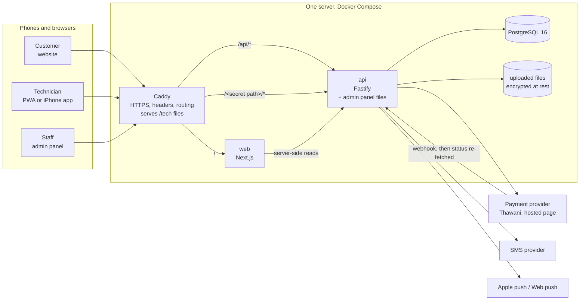

# Architecture

## Pieces

- **One domain.** Caddy routes `/api/*` to the API, `/tech/*` to the technician app's static files,
  the secret admin path to the API (which serves the admin panel's files), and everything else to the
  website. Any other admin-looking address is an ordinary 404.
- **One API** owns every rule. The three front ends only display what it returns; prices, commission,
  timers and permissions are computed on the server.
- **The iPhone app** is the same technician code bundled into a Capacitor shell, the Xcode project
  [`ios/Katf.xcodeproj`](../ios). It talks to the server set in the Xcode build setting `KATF_API_URL`
  with bearer tokens kept in the Keychain; the PWA uses HttpOnly cookies.

## Inside the API (`apps/api/src`)

| Folder | Responsibility |
|---|---|
| `routes/` | HTTP only: validation (zod), role checks, CSRF, calling a service. `public`, `auth`, `customer`, `tech`, `admin`, `webhooks`, `dev` (tests only) |
| `services/booking-core.ts` | Loads bookings, applies a state-machine transition with compare-and-set on `(id, status, version)`, writes `booking_events` |
| `services/bookings.ts` | The booking life cycle: create, pay, accept, travel, arrive (geofence), diagnose, quote, approve, complete, confirm, cancel, revisit, disputes |
| `services/ledger.ts` | Double-entry ledger. Every money movement is one transaction whose debits equal its credits (checked again by a database trigger) |
| `services/payouts.ts` | Payable items → payout batches → bank CSV → marked paid |
| `services/scheduler.ts` | Durable timers in `scheduled_jobs` (accept timeout, unpaid expiry, auto-confirm, payout due…), picked with `FOR UPDATE SKIP LOCKED`, so they survive restarts |
| `services/legal.ts` | Legal document versions, rendered snapshots, consents, forced re-acceptance, the legal gate |
| `services/notifications.ts` | In-app always; push first, SMS as fallback; quiet hours; editable templates |
| `services/settings.ts` | Every business number, with history; cached and reloaded across processes |
| `services/audit.ts` | Hash-chained, append-only audit log |
| `providers/` | Payments (mock, Thawani), SMS (console, mock, Twilio, HTTP), push (Web Push, APNs), mail |
| `lib/crypto.ts` | AES-256-GCM field encryption, HMAC blind indexes, signatures |

## Shared code

[`packages/shared`](../packages/shared) is used by the API and all three front ends, so a rule is written once:
money (`share`, `split`, `settleCompleted`, `cancelSplit`…), the settings registry with bounds,
the booking `TRANSITIONS` table, Omani phone/IBAN/civil-ID validation, Muscat time and slots, and the
common Arabic/English texts including every API error message (a test fails if one is missing).

## Language and direction

- Arabic is the default; English is the second language. The website keeps the choice in a cookie
  (`katf_lang`), the apps in local storage.
- Every style uses logical properties (`margin-inline-start`, `inset-inline-end`…). `pnpm lint` fails on
  physical left/right.
- Numbers are written with Latin digits; money and codes are isolated LTR inside Arabic text.

## Design system

[`packages/ui`](../packages/ui) holds the "floating glass" look: frosted surfaces over a soft aurora, one copper accent,
IBM Plex Sans Arabic and Readex Pro (self-hosted; no third-party font requests). Light and dark themes,
solid surfaces when the device asks for reduced transparency, and a 44 px minimum touch target.

## Environments

| | Database | Payments | SMS | Notes |
|---|---|---|---|---|
| Development | PGlite (embedded, in `apps/api/.data`) | mock page | printed to the log | `pnpm dev:*` |
| Tests | PGlite in memory | mock | mock outbox | fake clock; `pnpm test` |
| End-to-end | PGlite in a temp folder | mock page | mock outbox | own ports; `pnpm e2e` |
| Production | PostgreSQL 16 in Docker | mock until the legal gate opens, then Thawani | provider of the owner's choice | `deploy/` |
