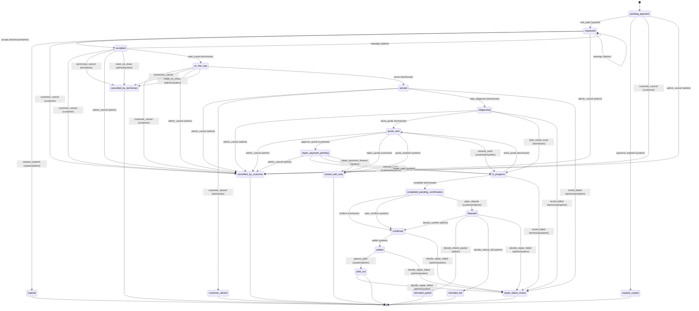

# Booking state machine

The single source is the `TRANSITIONS` table in [`packages/shared/src/booking.ts`](../packages/shared/src/booking.ts).
Every change goes through `transition()` in `apps/api/src/services/booking-core.ts`, which:

1. finds the allowed transition for (current status, event, actor role) — anything else is refused;
2. updates the row only if `(id, status, version)` still match (compare-and-set), so two people acting
   at once cannot both win (tested: two technicians accepting at the same moment → exactly one);
3. writes a `booking_events` row (append-only) and the money/ledger effects in the same transaction.

Timers (accept timeout, unpaid expiry, quote expiry, repair-payment timeout, auto-confirm, payout due)
are rows in `scheduled_jobs`, so they continue after a restart.

The diagram below is generated from the code (`pnpm --filter @katf/api cli state-machine`); CI fails if it
is out of date.

